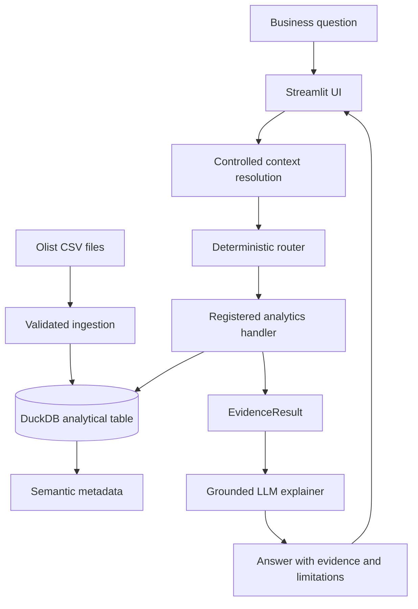

<h1 align="center">Evidence-Grounded Analytics Copilot</h1>

<p align="center"><strong>A conversational business-intelligence application that calculates answers with deterministic, tested analytics and uses an LLM only to explain the verified evidence.</strong></p>

<p align="center"><code>Python 3.12</code> · <code>DuckDB</code> · <code>pandas 2.3.3</code> · <code>Streamlit</code> · <code>Pydantic</code> · <code>OpenAI-compatible APIs</code> · <code>pytest</code> · <code>Ruff</code></p>

<!--
PROJECT PREVIEW — add after capturing the final assets.

Recommended hero image:
<p align="center">
  
</p>

Recommended links:
<p align="center">
  <a href="YOUR_DEMO_VIDEO_URL">90-second demo</a> ·
  <a href="YOUR_LIVE_APP_URL">Live application</a>
</p>
-->

## Recruiter snapshot

- Converts natural-language business questions into a **defined registry of deterministic analyses** instead of allowing unrestricted text-to-SQL generation.
- Builds a validated DuckDB analytical table from **seven Olist source files**, producing **112,650 order-item rows across 31 fields** in the current dataset build.
- Protects metric correctness through explicit table grain, order-level reductions, pre-aggregated joins, semantic column roles, and aggregation warnings.
- Returns every supported answer as a structured `EvidenceResult` containing metrics, supporting rows, methodology, and limitations.
- Uses an OpenAI-compatible LLM as a **constrained communication layer** after the analytical result has already been calculated.
- The final local verification reported **40 passing tests**, with Python 3.12 and pandas 2.3.3 locked to preserve the stable runtime.

## Overview

LLM-based analytics systems can sound convincing while using the wrong table grain, duplicating order-level values, inventing unsupported metrics, or generating invalid SQL. This project addresses that risk by separating **computation** from **language generation**.

A user asks a business question through Streamlit. The application resolves simple conversational follow-ups, maps the standalone question to a supported analysis, runs predefined SQL and Python logic against DuckDB, and packages the result into a standardized evidence object. Only then does the LLM translate the verified result into a readable business explanation. Unsupported questions are refused explicitly rather than guessed.

The result is a local, inspectable business-intelligence copilot that demonstrates data engineering, analytical SQL, metric design, modular Python architecture, safe LLM integration, and user-facing product development in one end-to-end system.

## Key features

- **Validated analytical data pipeline** — checks for required source files, loads raw CSVs into DuckDB, builds the analytical table, and verifies row grain, duplicate keys, null behavior, and invalid values.
- **Semantic metadata layer** — profiles the analytical table and records identifiers, dimensions, measures, time dimensions, business meanings, suggested aggregations, and warnings for repeated order-level values.
- **Deterministic question routing** — maps supported natural-language intents to registered analytical handlers using explicit, testable rules.
- **Reusable analytics engine** — calculates core KPIs, revenue trends, geographic and category performance, delivery outcomes, review relationships, and multi-step revenue-change investigations.
- **Structured evidence contract** — standardizes every result into an `EvidenceResult` with a summary, metrics, supporting rows, methodology, and warnings.
- **Evidence-grounded explanations** — sends only verified evidence to the LLM and constrains it to explain the supplied facts rather than calculate new ones.
- **Controlled conversational follow-ups** — retains recent supported context, resolves short follow-ups into standalone questions, and shows the user an explicit **“Interpreted as”** note.
- **Safe unsupported behavior** — bypasses the LLM for unsupported questions and returns a deterministic explanation of the current analytical boundary.
- **Streamlit product interface** — provides quick-question controls, chat history, processing status, supported/unsupported indicators, and expandable evidence and methodology.

## How it works



1. **Ingestion** validates the required Olist files and loads them into DuckDB staging tables.
2. **Transformation** joins orders, items, customers, products, payments, reviews, and category translations into one analytical table.
3. **Validation** checks the order-item grain and other data-quality invariants.
4. **Semantic profiling** documents what each column means and how it may be aggregated safely.
5. **Question processing** receives a standalone question or resolves a short follow-up using recent supported context.
6. **Routing** chooses one predefined analysis type.
7. **Analytics** executes tested SQL and Python logic against DuckDB.
8. **Evidence assembly** returns a typed `EvidenceResult`.
9. **Explanation** converts that evidence into a concise business answer through an OpenAI-compatible model endpoint.
10. **Presentation** exposes the answer, status, evidence, methodology, and analytical warnings in Streamlit.

## Supported analyses

The application intentionally supports a bounded analytical surface. That boundary is part of the trust model.

| Analysis | Example question | Main output |
|---|---|---|
| Core marketplace KPIs | “Give me an overview of the main business KPIs.” | Revenue, orders, average order value, late-delivery rate, and review score |
| Monthly revenue trend | “How has revenue changed over time?” | Complete-month revenue and month-over-month growth |
| Revenue by product category | “Which product categories generate the most revenue?” | Ranked category revenue, order count, and revenue share |
| Revenue by customer state | “Which states generate the most revenue?” | Ranked state revenue, order count, and revenue share |
| Delivery performance by state | “Which states have the worst delivery performance?” | Late-delivery rate, delivery duration, order volume, and review metrics |
| Late versus on-time orders | “How do late deliveries affect customer review scores?” | Review-score and delivery-duration comparison by delivery status |
| Revenue-change investigation | “Why did revenue decline in June 2018?” | Revenue, order-volume, average-order-value, category, and state decomposition |

Questions that do not match a supported route return a clear refusal. The system does not silently broaden the request or ask the LLM to improvise an answer.

## Example conversation

```text
User
Why did revenue decline in June 2018?

Copilot
Returns the verified month-over-month change, order-count movement,
average-order-value movement, and leading category/state contributors.

User
What about the categories?

Interpreted as
Which product categories contributed most to the revenue change in June 2018?

Copilot
Runs the supported revenue-change investigation with category-level evidence.
```

The visible interpretation step makes contextual behavior inspectable instead of silently rewriting the user's request.

## Evidence model

All analytical handlers return the same typed contract:

```python
class EvidenceResult(BaseModel):
    question: str
    analysis_type: AnalysisType
    supported: bool
    summary: str
    metrics: dict[str, Any]
    supporting_rows: list[dict[str, Any]]
    methodology: dict[str, Any]
    warnings: list[str]
```

This contract separates responsibilities cleanly:

- Analytics functions calculate facts.
- Evidence handlers package those facts consistently.
- The LLM explains only the packaged evidence.
- Streamlit renders the same structure regardless of analysis type.
- Tests can verify the deterministic result without making an external model request.

## Data and metric correctness

The core analytical table uses the following grain:

> **One row represents one purchased item within an order.**

That choice makes item-level revenue additive, but it also creates a major risk: payment totals, review scores, and other order-level fields repeat across every item in the same order. The project addresses this explicitly.

| Concern | Implemented rule |
|---|---|
| Revenue | `SUM(item_price)` at the order-item grain |
| Order count | `COUNT(DISTINCT order_id)` |
| Average order value | Item revenue divided by distinct orders |
| Payments | Aggregated to one row per order before joining |
| Reviews | Aggregated to one row per order before joining |
| Delivery and review comparisons | Reduced to one row per order before aggregation |
| Incomplete months | Excludes months below the dataset-specific minimum order threshold |
| Small geographic samples | State delivery rankings require a minimum order count |

The evidence layer also preserves limitations such as:

- Item revenue excludes freight.
- Revenue is not profit because product cost is unavailable.
- Geographic and delivery comparisons are descriptive associations, not causal proof.
- Review averages use only orders with available reviews.

## Architecture and engineering decisions

### 1. Deterministic before probabilistic

The router and analytics engine establish the result before the model is called. This makes the numerical path reproducible, testable, and independent of model behavior. The tradeoff is a bounded question set rather than arbitrary text-to-SQL coverage.

### 2. Structured evidence instead of free-form handoffs

The application passes a typed evidence object between analytics, explanation, and presentation layers. This reduces coupling and prevents the LLM from becoming the source of truth.

### 3. Semantic metadata for aggregation safety

Schema profiling alone reveals data types and null counts, but not business meaning. The semantic layer records grain, column roles, recommended aggregations, and warnings for values that would be double-counted if summed at the item level.

### 4. Safe refusal over fabricated coverage

Unsupported questions return a deterministic response and do not become trusted conversational context. This prevents a failed turn from contaminating later follow-up interpretation.

### 5. Reliability over visual complexity

The UI contains analysis-specific metric and chart utilities, but the current stable answer path prioritizes Markdown and JSON-style evidence rendering. This choice followed runtime debugging around Arrow-backed DataFrame conversion and keeps the working path dependable.

## Project evolution

| Phase | Change introduced | Outcome |
|---|---|---|
| 1 — Trusted data layer | Raw-file validation, DuckDB staging tables, analytical-table construction, integrity checks | Reproducible ETL pipeline with a defined order-item grain |
| 2 — Semantic intelligence | Table profiling, semantic column roles, business definitions, aggregation warnings | Machine-readable understanding of how the data should be used |
| 3 — Analytics engine | Core KPIs, revenue segmentation, delivery analysis, review coverage, robust statistics | Reusable and tested business calculations |
| 4 — Evidence engine | Deterministic router, handler registry, multi-step investigations, standardized evidence objects | Natural-language questions mapped to inspectable analytical evidence |
| 5 — Explanation layer | OpenAI-compatible client, prompt guardrails, dependency injection, unsupported-question handling | Readable business explanations without giving the model ownership of the numbers |
| 6 — Productization | Streamlit interface, session history, contextual follow-ups, safe context rules, runtime stabilization | Working end-to-end evidence-grounded BI application |

## Technology stack

| Layer | Technology | Role |
|---|---|---|
| Language and runtime | Python 3.12 | Application, analytics, ingestion, and test implementation |
| Environment management | uv | Python installation, dependency locking, and command execution |
| Analytical database | DuckDB | Local OLAP storage and SQL execution |
| Data processing | pandas 2.3.3 | Result transformation and analytical tabular operations |
| User interface | Streamlit | Interactive conversational BI application |
| Visualization | Plotly | Analysis-specific chart-generation utilities |
| Data contracts | Pydantic | Typed routing and evidence models |
| LLM integration | OpenAI Python client | OpenAI-compatible Chat Completions interface |
| Configuration | python-dotenv | Local environment-variable loading |
| Testing | pytest | Unit and integration-style validation |
| Code quality | Ruff | Linting and formatting |

## Repository structure

```text
.
├── .streamlit/
│   └── config.toml              # Application theme and browser settings
├── app/
│   ├── analytics/
│   │   ├── build_metadata.py    # Semantic metadata build command
│   │   ├── delivery.py          # Delivery and review analyses
│   │   ├── metrics.py           # Core KPI calculations and DB access
│   │   ├── profiling.py         # Table and column profiling
│   │   ├── revenue.py           # Revenue trends and segmentation
│   │   └── semantic.py          # Business roles and aggregation rules
│   ├── database/
│   │   ├── ingestion.py         # CSV loading and analytical-table creation
│   │   └── validation.py        # Data-quality and grain validation
│   ├── evidence/
│   │   ├── engine.py            # Evidence pipeline entry point
│   │   ├── handlers.py          # Analysis-specific evidence assembly
│   │   ├── investigations.py    # Multi-step revenue investigations
│   │   ├── models.py            # RouteDecision and EvidenceResult contracts
│   │   ├── registry.py          # Analysis type to handler mapping
│   │   └── router.py            # Deterministic intent routing
│   ├── llm/
│   │   ├── client.py            # OpenAI-compatible client construction
│   │   ├── config.py            # LLM environment configuration
│   │   ├── explainer.py         # Grounded explanation generation
│   │   ├── prompts.py           # Explanation guardrails and prompt assembly
│   │   └── rewriter.py          # Contextual rewrite utility with safe fallback
│   ├── config.py                # Data paths, table names, and required files
│   ├── copilot.py               # Full command-line copilot
│   └── streamlit_app.py         # Main product interface
├── data/
│   ├── raw/                     # Local Olist CSV files; not committed
│   ├── processed/               # DuckDB database and metadata; not committed
│   └── sample/                  # Small local/sample assets when available
├── tests/                       # Analytics, ingestion, evidence, and LLM tests
├── .python-version              # Python 3.12 project pin
├── pyproject.toml               # Dependencies and project configuration
├── streamlit_app.py             # Root Streamlit entry point
└── uv.lock                      # Locked dependency graph
```

## Installation and setup

### Prerequisites

- [uv](https://docs.astral.sh/uv/)
- Git
- Access to an OpenAI-compatible Chat Completions endpoint for generated explanations
- The [Brazilian E-Commerce Public Dataset by Olist](https://www.kaggle.com/datasets/olistbr/brazilian-ecommerce)

### 1. Clone the repository

```bash
git clone https://github.com/asim-aa/evidence-grounded-analytics-copilot.git
cd evidence-grounded-analytics-copilot
```

### 2. Recreate the locked Python environment

```bash
uv python install 3.12
uv sync
```

The stable project configuration uses Python 3.12 and pins pandas to 2.3.3.

### 3. Download the dataset

Using the Kaggle CLI included in the development dependencies:

```bash
uv run kaggle datasets download \
  -d olistbr/brazilian-ecommerce \
  -p data/raw \
  --unzip
```

Alternatively, download and extract the dataset manually. The following files must be present in `data/raw/`:

```text
olist_orders_dataset.csv
olist_order_items_dataset.csv
olist_customers_dataset.csv
olist_products_dataset.csv
olist_order_payments_dataset.csv
olist_order_reviews_dataset.csv
product_category_name_translation.csv
```

### 4. Build and validate the analytical database

```bash
uv run python -m app.database.ingestion
```

This command:

- validates the required files;
- loads the source CSVs into DuckDB;
- builds `data/processed/olist_analytics.duckdb`;
- creates the `order_items_analytics` table;
- runs validation checks; and
- prints a sample analysis.

### 5. Generate semantic metadata

```bash
uv run python -m app.analytics.build_metadata
```

The generated metadata is written to:

```text
data/processed/semantic_metadata.json
```

### 6. Configure the LLM endpoint

Create a `.env` file in the repository root:

```dotenv
LLM_BASE_URL=https://your-openai-compatible-endpoint/v1
LLM_API_KEY=your-api-key
LLM_MODEL=your-model-name
LLM_TIMEOUT_SECONDS=60
```

The endpoint must support the OpenAI-compatible Chat Completions interface. Keep `.env` private; it is excluded by `.gitignore`.

### 7. Launch the application

```bash
uv run streamlit run streamlit_app.py
```

Streamlit will print the local application URL in the terminal.

## Usage

### Streamlit application

1. Start the app.
2. Choose a quick question from the sidebar or enter one in the chat input.
3. Review the evidence-backed response.
4. Expand **View evidence and methodology** to inspect metrics, supporting rows, calculation rules, and limitations.
5. Ask a short follow-up or clear the conversation from the sidebar.

### Full command-line copilot

```bash
uv run python -m app.copilot \
  "Why did revenue decline in June 2018?" \
  --show-evidence
```

This runs the deterministic evidence pipeline, generates the explanation, and optionally prints the full evidence object.

### Evidence engine without the LLM explanation

```bash
uv run python -m app.evidence.engine \
  "Which product categories generate the most revenue?"
```

This prints the deterministic `EvidenceResult` as formatted JSON and is useful for debugging or validating the analytical path independently of the model.

## Testing and validation

Run the automated test suite:

```bash
uv run pytest
```

Run linting:

```bash
uv run ruff check streamlit_app.py app tests
```

Check formatting without modifying files:

```bash
uv run ruff format --check streamlit_app.py app tests
```

The final local verification reported **40 passing tests**. The suite covers:

- required-file and ingestion behavior;
- analytical-table grain and invalid-value checks;
- core KPI definitions;
- revenue trends and segmentation;
- delivery performance and robust statistics;
- review coverage and late/on-time comparisons;
- semantic metadata generation;
- deterministic routing and evidence handlers;
- revenue-change investigations; and
- grounded explanation and unsupported-question behavior.

The Streamlit runtime was also validated through layered manual smoke testing of imports, startup rendering, question execution, evidence retrieval, LLM generation, and answer rendering.

## Limitations

- The application supports a fixed registry of analyses; it is **not** an arbitrary text-to-SQL agent.
- The Olist dataset is historical, covering approximately 100,000 anonymized orders from 2016–2018, rather than live operational data.
- Item revenue excludes freight and cannot be interpreted as profit because product cost is unavailable.
- The complete-month and minimum-order thresholds are dataset-specific analytical rules, not universal standards.
- Geographic, delivery, and review comparisons are descriptive and do not establish causation.
- Conversation history is stored in Streamlit session state and is not persisted across browser sessions.
- The current application is designed for local, single-user execution and does not include authentication or production deployment infrastructure.
- Generated explanations require a reachable OpenAI-compatible endpoint. The deterministic evidence engine remains independently executable.
- The stable answer renderer emphasizes Markdown and JSON-style evidence inspection over the richer chart/table rendering utilities present in the UI module.

## Practical next steps

- Add the final hero screenshot, evidence screenshot, and 60–90 second demo.
- Add GitHub Actions for automated pytest and Ruff checks.
- Build a labeled evaluation set for router accuracy, follow-up resolution, refusal behavior, and explanation faithfulness.
- Expand the handler registry only when each new analysis has an explicit metric definition, evidence contract, and test coverage.
- Add deployment configuration if the application is published as a hosted demo.

## Skills demonstrated

- Analytical SQL and grain-aware data modeling
- ETL pipeline design and data-quality validation
- DuckDB-based analytics engineering
- Semantic metadata and metric-governance design
- Deterministic intent routing and handler registries
- Structured data contracts with Pydantic
- Evidence-grounded LLM integration
- Conversational state and safe context handling
- Streamlit product development
- Unit testing, integration testing, debugging, and dependency stabilization
- Modular Python architecture and technical documentation

## Dataset attribution

The project uses the [Brazilian E-Commerce Public Dataset by Olist](https://www.kaggle.com/datasets/olistbr/brazilian-ecommerce), which contains anonymized Brazilian marketplace orders from 2016–2018. The dataset is distributed separately under the **CC BY-NC-SA 4.0** license and is not committed to this repository.

## Author

**Asim Ahmed**

- GitHub: [asim-aa](https://github.com/asim-aa)
- Email: [asa009@ucsd.edu](mailto:asa009@ucsd.edu)

<!-- Add LinkedIn here once the confirmed profile URL is available. -->

## License

A source-code license has not yet been specified for this repository. Add a `LICENSE` file before inviting reuse or external contributions. The Olist dataset is governed by its separate CC BY-NC-SA 4.0 license.